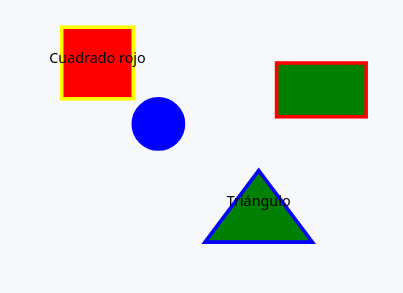

# Nombre del lenguaje: SVGlite

## Vision del Lenguaje

Nuestro lenguaje de programación está diseñado para facilitar la creación eficiente de gráficos y visualizaciones a través de una sintaxis sencilla y estructurada. Su propósito es proporcionar una herramienta robusta que permita la representación de figuras geométricas básicas y la personalización de sus atributos visuales. Nos enfocamos en que el programador no pierda demasiado tiempo dando especificaciones para crear una figura, indicando el tipo, las coordenadas y las dimensiones ya es posible crear una y en caso de necesitar mas especificaciones tambien estan pero de manera opcional, no son obligatorias para la generacion de una figura. El diseño del lenguaje tiene como objetivo ademas de la rapidez y eficiencia, la facilidad de aprendizaje
para los usuarios que lo requieran, gracias a su simplicidad la curva de aprendizaje es mas suave y no se pierde demasiado tiempo tanto aprendiendolo como desarrollando en él. Puede usarse tanto en el ambito educativo para enseñar a personas inexpertas en el tema o tambien en proyectos en donde se quiera generar figuras de una manera rapida, simple y eficiente.

## Especificacion Lexica

### Definición de tokens

SVGlite posee los siguientes tipos de tokens: tokens para figuras, tokens para números, tokens para colores, tokens para atributos, tokens para cadenas de caracteres, tokens de puntuación y tokens para espacios. Todos los anteriormente mencionados estarán detallados a continuación.

#### Tokens para figuras

```
KEYWORD_CUADRADO     ::= "cuad"
KEYWORD_RECTANGULO   ::= "rec"  
KEYWORD_CIRCULO      ::= "circ"  
KEYWORD_TRIANGULO    ::= "tri"
```

#### Tokens para números

```
NUMBER                ::= [0-9]+
```

#### Tokens para colores
```
COLOR_BLUE             ::= "blue"
COLOR_YELLOW           ::= "yellow"
COLOR_RED              ::= "red"
COLOR_GREEN            ::= "green"
```

#### Tokens para atributos
```
KEYWORD_FILL       ::= "fill"  
KEYWORD_BORDER     ::= "border"
KEYWORD_TEXT       ::= "text"
```

#### Token para cadena de caracteres
```
STRING   ::= [^'] {0,1024}
```

#### Tokens para puntuacion
```
SEMICOLON            ::= ";"
ASSIGN               ::= "="
STRING_DELIMITER     ::= "'"
```

#### Token para espacios (blancos)
```
WHITESPACE           ::= [ \t\n\r]+
```

## Especificacion Sintactica

```
<unidad-de-traduccion> ::= {<figura> <punto-y-coma>}*

<figura> ::= <figura-cuadrado> | <figura-rectangulo> | <figura-circulo> | <figura-triangulo>

<figura-cuadrado> ::= KEYWORD_CUADRADO <coordenadas> <dimensiones-cuadrado> <atributos>

<figura-rectangulo> ::= KEYWORD_RECTANGULO <coordenadas> <dimensiones-rectangulo> <atributos>

<figura-circulo> ::= KEYWORD_CIRCULO <coordenadas> <dimensiones-circulo> <atributos>

<figura-triangulo> ::= KEYWORD_TRIANGULO <coordenadas> <dimensiones-triangulo> <atributos>

<coordenadas> ::= NUMBER NUMBER

<dimensiones-cuadrado> ::= <lado>

<dimensiones-rectangulo> ::= <base> <altura>

<dimensiones-circulo> ::= <diametro>

<dimensiones-triangulo> ::= <base> <altura>

<lado> ::= NUMBER

<base> ::= NUMBER

<altura> ::= NUMBER

<diametro> ::= NUMBER

<atributos> ::= {<atributo>}*

<atributo> ::= <atributo-fill> | <atributo-border> | <atributo-text>

<atributo-fill> ::= KEYWORD_FILL ASSIGN <color>

<atributo-border> ::= KEYWORD_BORDER ASSIGN <color>

<atributo-text> ::= KEYWORD_TEXT ASSIGN STRING_DELIMITER STRING STRING_DELIMITER

<color> ::= COLOR_GREEN | COLOR_YELLOW | COLOR_BLUE | COLOR_RED

<punto-y-coma>  ::= SEMICOLON

```

## Especificacion Semantica

### Semantica de las figuras 

Cada figura define las coordenas (X,Y) con valor numerico que indica en pixeles la posicion que tomara dentro del lienzo.  
Ademas cada figura tiene su propia especificacion para la definicion de sus dimensiones la cual esta medida en pixeles

###### Restricciones 
- Cuando una figura es definida fuera de las coordenadas predefinidas del lienzo el interprete devolverá un error

### Cuadrado (cuad)

El cuadrado se define por sus coordenadas (X, Y), y un `lado`  
`cuad X Y lado`


### Rectángulo (rec): 

Un rectángulo se define por sus coordenadas (X, Y), su `base`y `altura`.  
`rect X Y base altura`


### Círculo (circ):

Un círculo se define por sus coordenadas (X, Y) y su `diámetro`.  
`circ X Y diametro`


### Triángulo (tri):

Un triángulo se define por sus coordenadas (X, Y), su `base` y `altura`.  
`tri X Y base altura`


### Semántica de los Atributos
  
- Si un mismo atributo es asignado 2 o más veces a una misma figura,se devolverá un error

### Atributo fill:

El atributo fill define el color de relleno de una figura. Si está presente, el color se aplica a la figura, de lo contrario, se usa un color por defecto

###### Restricciones (fill)
- No puede definirse una figura con mas de un atributo fill

### Atributo border:

El atributo border define el color del borde de una figura. Si está presente, el borde se aplica, de lo contrario, se aplica un borde con un color por defecto

###### Restricciones (border)
- No puede definirse una figura con mas de un atributo border
 

### Atributo text:

El atributo text permite agregar texto asociado a una figura. El texto se coloca en las coordenadas de la figura.

###### Restricciones (text)
- No puede definirse una figura con mas de un atributo text


### Semantica de comportamiento predefinido
 - Las figuras tienen como valor default los siguientes atributos:
    - fill= green
    - border= blue
Ejemplo: Si definimos un cuadrado sin atributos `cuad X Y L` se graficara el cuadrado por defecto  


 - El tamaño del "lienzo" tendra como valor predefindo los siguientes parametros (definidos en pixeles):
    - ancho=100 
    - alto=100
    
- El color del texto introducido en la figura será negro

## Programa Ejemplo

La siguiente linea de codigo dibujara un rectangulo de coordenadas (45 , 23) de 10 px de ancho por 20 px de alto, con relleno de color azul y el texto 'Esto es un rectangulo'

 ``` rec 45 23 10 20 fill = blue text = 'Esto es un rectangulo'; ```

#### Salida Ejemplo


### Ejemplo que abarca todos los aspectos del lenguaje 
#### (Basado en la postcard de SmallTalk)

Mediante este archivo pretendemos hacer visible cada parte del lenguaje SVGlite para que los usuarios entiendan de forma clara el alcance de este lenguaje y como trabajar con él. Nos enfocamos en generar figuras geometricas declarandolas de la manera mas simple y sencilla posible. Como vamos a ver en el ejemplo de mas abajo, usamos strings ya predefinidos por el lenguaje para atributos como el color y el borde, y enteros para indicar posicion y tamaño, cada una se declara de diferente manera y hay casos en los que se pueden omitir atributos e igualmente generar una figura. A continuacion se muestra un ejemplo que permitira conocer cada uno de los aspectos del lenguaje SVGlite.

```
cuad 10 10 20 fill = red border = yellow text = 'Cuadrado rojo';
circ 30 30 15 fill = blue;
tri 50 50 20 30 text = 'Triángulo';
rec 70 20 25 15 border = red;
```  
#### Resultados Esperados


